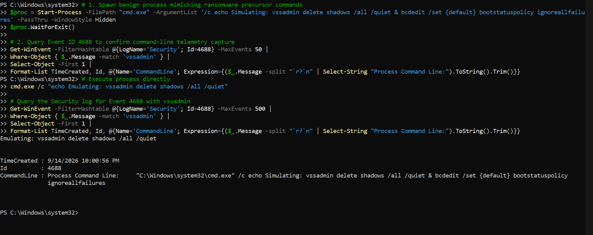
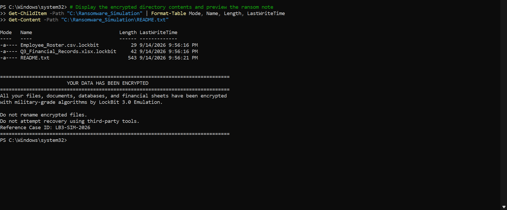
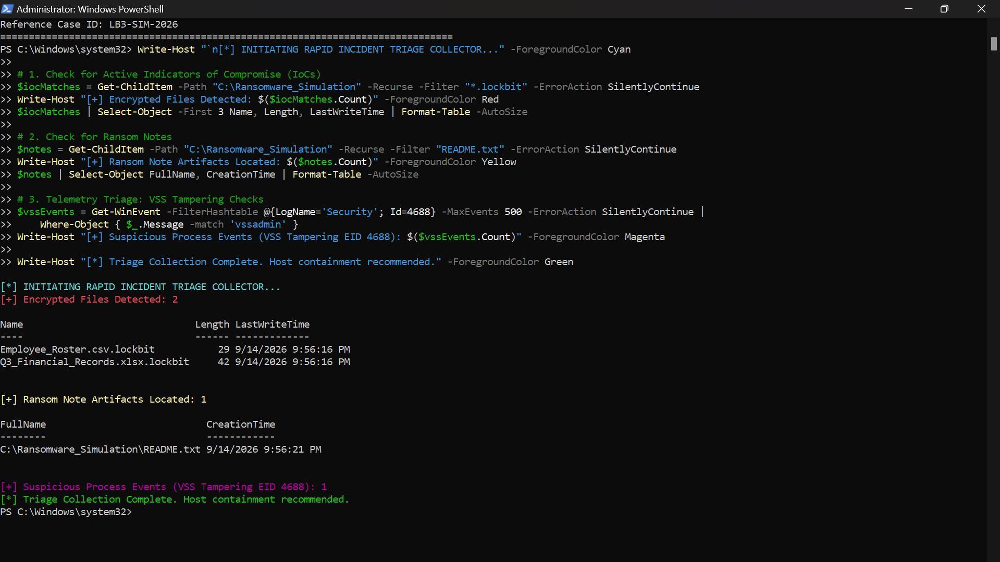

# Ransomware Incident Response Playbook & Endpoint Triage Simulation


---

## Executive Summary

This project demonstrates an end-to-end Digital Forensics and Incident Response (DFIR) investigation targeting simulated **LockBit 3.0** precursor execution and data encryption tradecraft. Mapped to the **NIST SP 800-61 Rev. 2** lifecycle and the **MITRE ATT&CK** framework, this repository contains endpoint audit configurations, live artifact extraction, an automated PowerShell incident triage engine, and production-ready Sigma detection rules.

---

## Threat Scenario & MITRE ATT&CK Mapping

Adversaries deploying ransomware typically execute deliberate defense inhibition steps to prevent system restoration before encrypting user directories.

| Tactic | Technique ID | Technique Name | Simulation Behavior |
| :--- | :--- | :--- | :--- |
| **Defense Evasion / Impact** | `T1490` | Inhibit System Recovery | Process spawning attempting Shadow Copy deletion (`vssadmin delete shadows /all /quiet`) |
| **Impact** | `T1486` | Data Encrypted for Impact | Iterative batch file encryption targeting corporate spreadsheets with `.lockbit` extension |
| **Execution** | `T1059.001` | Command and Scripting Interpreter | PowerShell & CMD-driven automated triage collection and artifact staging |

---

## Phase 1: Telemetry Setup & Process Auditing

To ensure forensic visibility into living-off-the-land binaries (LOLBins) used by ransomware operators, detailed process creation auditing was configured via `auditpol` and system registry:

```powershell
# Enable Detailed Process Creation Tracking
auditpol /set /subcategory:"Process Creation" /success:enable /failure:enable

# Enable Command-Line Argument Logging
reg add "HKLM\Software\Microsoft\Windows\CurrentVersion\Policies\System\Audit" /v ProcessCreationIncludeCmdLine_Enabled /t REG_DWORD /d 1 /f
```

---

## Phase 2: Evidence Analysis & Artifact Scoping

### Artifact 1 — Inhibit System Recovery Telemetry (EID 4688)

Ransomware execution relies on deleting backup shadow copies to force ransom payment. Windows Security Event ID 4688 captured the exact parent process and command-line execution parameters:

```
Event ID: 4688
Channel: Security
Process Command Line: "C:\Windows\system32\cmd.exe" /c echo Simulating: vssadmin delete shadows /all /quiet & bcdedit /set {default} bootstatuspolicy ignoreallfailures
```

<p align="center">
  
</p>
<p align="center"><em>Figure 1: Event ID 4688 capturing the simulated VSS tampering command line.</em></p>

### Artifact 2 — Encrypted Storage & Ransom Note Artifacts

Inspection of the victim workspace confirmed active ransomware impact: business records were renamed with the target extension and accompanied by extortion metadata.

<p align="center">
  
</p>
<p align="center"><em>Figure 2: Simulated workspace showing `.lockbit`-renamed files alongside the dropped ransom note.</em></p>

---

## Phase 3: Automated Incident Triage Collector

In live DFIR scenarios, speed is vital to determine blast radius before endpoint isolation. A rapid automated triage script was developed to scope encrypted extensions, ransom notes, and process manipulation indicators.

```powershell
Write-Host "`n[*] INITIATING RAPID INCIDENT TRIAGE COLLECTOR..." -ForegroundColor Cyan

# 1. Scope Encrypted IoCs
$iocMatches = Get-ChildItem -Path "C:\Ransomware_Simulation" -Recurse -Filter "*.lockbit" -ErrorAction SilentlyContinue
Write-Host "[+] Encrypted Files Detected: $($iocMatches.Count)" -ForegroundColor Red
$iocMatches | Select-Object -First 3 Name, Length, LastWriteTime | Format-Table -AutoSize

# 2. Scope Ransom Note Drops
$notes = Get-ChildItem -Path "C:\Ransomware_Simulation" -Recurse -Filter "README.txt" -ErrorAction SilentlyContinue
Write-Host "[+] Ransom Note Artifacts Located: $($notes.Count)" -ForegroundColor Yellow
$notes | Select-Object FullName, CreationTime | Format-Table -AutoSize

# 3. Telemetry Triage: VSS Tampering Checks
$vssEvents = Get-WinEvent -FilterHashtable @{LogName='Security'; Id=4688} -MaxEvents 500 -ErrorAction SilentlyContinue |
    Where-Object { $_.Message -match 'vssadmin' }
Write-Host "[+] Suspicious Process Events (VSS Tampering EID 4688): $($vssEvents.Count)" -ForegroundColor Magenta
```

<p align="center">
  
</p>
<p align="center"><em>Figure 3: Triage collector output showing encrypted file counts, ransom note artifacts, and VSS tampering hits.</em></p>

---

## Phase 4: Detection Engineering (Sigma Rule)

To proactively alert SOC analysts across SIEM platforms (Splunk, Elastic, Microsoft Sentinel), a detection rule was engineered targeting shadow copy deletion:

```yaml
title: Inhibit System Recovery via VSSAdmin Shadow Deletion
id: e4b2f1a0-9831-4c4f-8cf2-5e12f6b39d10
status: experimental
description: Detects command-line execution of vssadmin attempting to delete volume shadow copies, a common precursor to ransomware execution.
references:
    - https://attack.mitre.org/techniques/T1490/
tags:
    - attack.impact
    - attack.defense_evasion
    - attack.t1490
logsource:
    category: process_creation
    product: windows
detection:
    selection:
        Image|endswith:
            - '\vssadmin.exe'
            - '\cmd.exe'
            - '\powershell.exe'
        CommandLine|contains|all:
            - 'delete'
            - 'shadows'
    condition: selection
falsepositives:
    - Legitimate administrative backup scripts or software installations.
level: high
```

---

## Phase 5: Incident Response Playbook (NIST SP 800-61 Rev. 2)

### 1. Identification & Scoping
- Validate alert triggers (Event ID 4688 command-line match or file rename surge).
- Execute `triage_collector.ps1` to aggregate disk and process indicators without altering metadata.

### 2. Containment
- **Network Isolation:** Cut physical network cables or issue host isolation via EDR to halt lateral movement (SMB/RDP).
- **Account Lockdown:** Revoke active tokens and force password resets on compromised user accounts.

### 3. Eradication
- Terminate malicious parent processes identified via command line.
- Remove persistence mechanisms (Scheduled Tasks, Registry Run keys).

### 4. Recovery
- Verify endpoint is clean via offline antivirus scan and memory analysis.
- Restore compromised files strictly from validated, immutable off-site backups.

### 5. Lessons Learned
- Implement Attack Surface Reduction (ASR) rules blocking credential theft and LOLBin abuse.
- Enforce Least Privilege access controls on backup infrastructures.

---
---

## Strategic Recommendations & Hardening

To mitigate ransomware dwell time and prevent successful precursor staging, enterprise environments should enforce the following defensive controls:

1. **Deploy Attack Surface Reduction (ASR) Rules:** Enable Windows Defender ASR rules specifically targeting `Block process creations originating from PSExec and WMI commands` and `Block executable files from running unless they meet a prevalence, age, or trusted list criterion`.
2. **Implement Tamper-Resilient Volume Backups:** Transition from local Volume Shadow Copies (VSS) to immutable, air-gapped, or off-site cloud storage. Restrict `vssadmin.exe` execution permissions to dedicated domain administrative accounts via AppLocker/WDAC.
3. **Enforce Least Privilege & Tiered Administration:** Prevent workstation users from maintaining local administrative rights. Ensure service accounts lack permissions to manipulate recovery binaries (`bcdedit`, `wbadmin`, `vssadmin`).
4. **Mandate Constrained Language Mode (CLM):** Pair PowerShell Script Block Logging with CLM to block unapproved COM objects and .NET reflective invocations commonly used in pre-encryption staging.
5. **Automate Endpoint Isolation:** Integrate SIEM detection alerts (such as the VSS deletion Sigma rule) directly into SOAR or EDR workflows to quarantine compromised endpoints within seconds of precursor detection.
